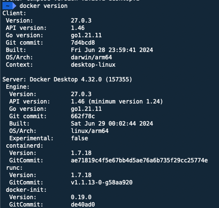

### Prerequisites

Install [Docker](https://docs.docker.com/engine/install/) it is available for a range of Operating Systems. Follow the steps in the link.
After installing you will need to enable Compose v2, if using Docker Desktop. For Linux users you can install it as a [Plugin](https://docs.docker.com/compose/install/linux/).



!!! note

    This project uses specific Docker Compose v2 features that only work with Docker Compose v2 2.20.2+.

If you're using Windows, it will be expected that you're following along inside of [WSL or WSL 2](https://nickjanetakis.com/blog/a-linux-dev-environment-on-windows-with-wsl-2-docker-desktop-and-more). That's because we're going to be running shell commands. You can always modify these commands for PowerShell if you want.

### Checkout Code

Clone the repository

```
git clone https://github.com/wattlehq/mimosa mimosa
cd mimosa
```

Copy the example .env file

```
cp .env.example .env
```

!!! note

    The .env.example file contains default settings to get the project up and running quickly, you should however populate any passwords with complex/lengthy values.

    To populate the values for Stripe, follow the instructions in the [Infrastructure and Database Setup](#infrastructure-and-database-setup) section.

    Email Configuration allows you to test sending Certificate Order emails to Customers, if using this functionality you should populate these values as required.

### Build Stack

The first time you run this it's going to take 5-10 minutes depending on your internet connection speed and computer's hardware specs. That's because it's going to download a few Docker images and build the Python + Yarn dependencies.

```
docker compose up --build
```

Now that everything is built and running we can treat it like any other Django app.

### Build Issues

- If you receive a `depends_on` "Additional property required is not allowed" error? Please update to at least Docker Compose v2.20.2+ or Docker Desktop 4.22.0+.

- If you receive an error about a port being in use? Chances are it's because something on your machine is already running on port 8000. Check out the docs in the `.env file` for the `DOCKER_WEB_PORT_FORWARD` variable to fix this.

- If you receive a permission denied error? Chances are you're running native Linux and your `uid:gid` aren't `1000:1000` (you can verify this by running id). Check out the docs in the `.env` file to customize the `UID` and `GID` variables to fix this.

### Infrastructure and Database Setup

```
./run manage migrate # You can run this from a 2nd terminal.
```

Start the Stripe webhook service, copy and paste webhook secret into `.env`, then stop.

```
docker-compose up stripe
```

!!! Note

    In order to have the webhook secret generated, you should have received an invite to your organisation's Stripe Team, if not please contact the team responsible for this prior to running the previous command.

Create a new admin super user.

```
./run manage createsuperuser
```
