# Model Setup

In order to deploy and run the Web Application successfully, you will need to set up several models - specifically `Properties`, `Certificates`, and `Fees`.

Access the Django Admin by browsing to: [http://localhost:8000/admin](http://localhost:8000/admin)

## Properties Model

1. From the left-hand side, select "Properties"

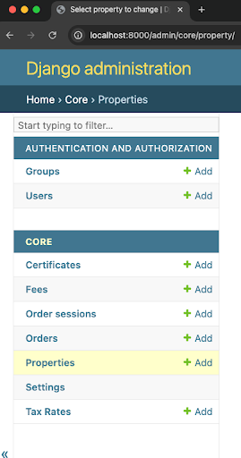

2. Select "Add Property" from the top-right corner
3. Enter the relevant information and click "Save"

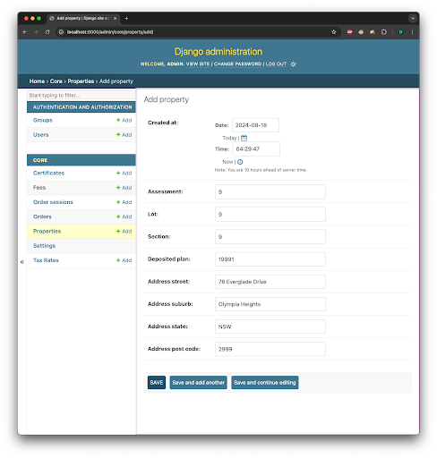

The property you just added should now be saved and viewable within the Properties section:

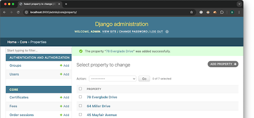

## Tax Rate Model

1. From the left-hand side menu, select "Tax Rates"

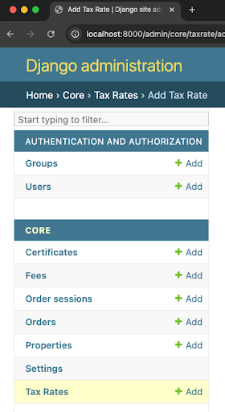

2. Click "Add Tax Rate" from the top-right corner
3. Enter details for the Tax Rate
4. Check "Is Active"
5. Click "Save"

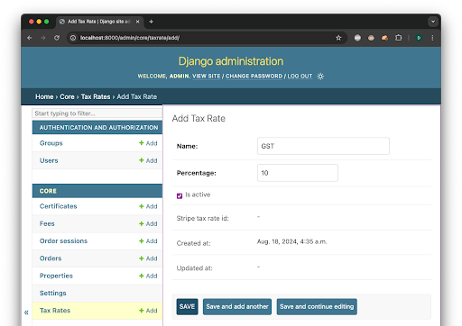

Your new Tax Rate is now saved:

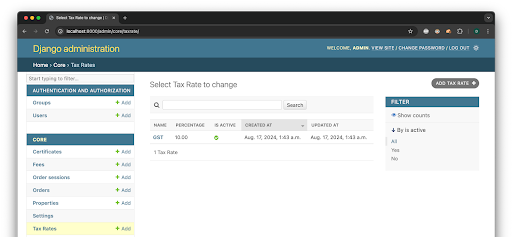

## Fees Model

1. From the left-hand side menu, select "Fees"

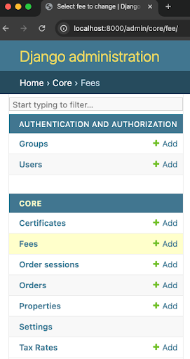

2. Select "Add Fee" from the top-right corner
3. Enter the desired Fee details
4. Apply Tax Rate if applicable
5. Click "Save"

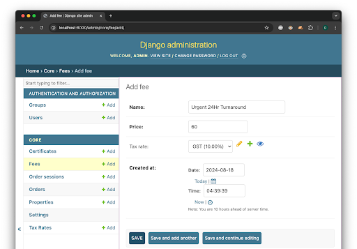

Your saved Fee is now available:

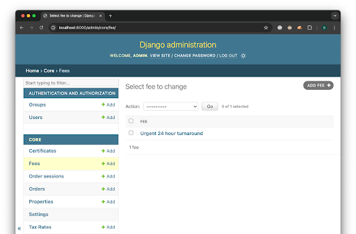

## Certificates Model

1. From the left-hand side menu, select "Certificates"

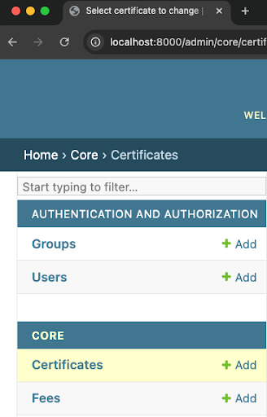

2. From the top-right, select "Add Certificate"
3. Add required details:
   - Name
   - Price
   - Tax Rate (if applicable)
   - Description

4. If a Fee should be associated with the Certificate:
   - Select the Fee Name
   - Click "+"

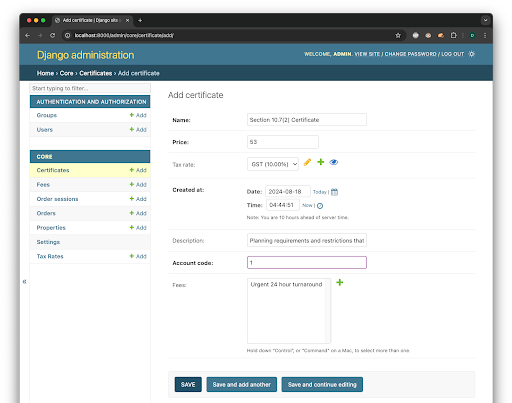

5. Click "Save"

Your new Certificate is now saved. Repeat these steps for any additional certificates required.

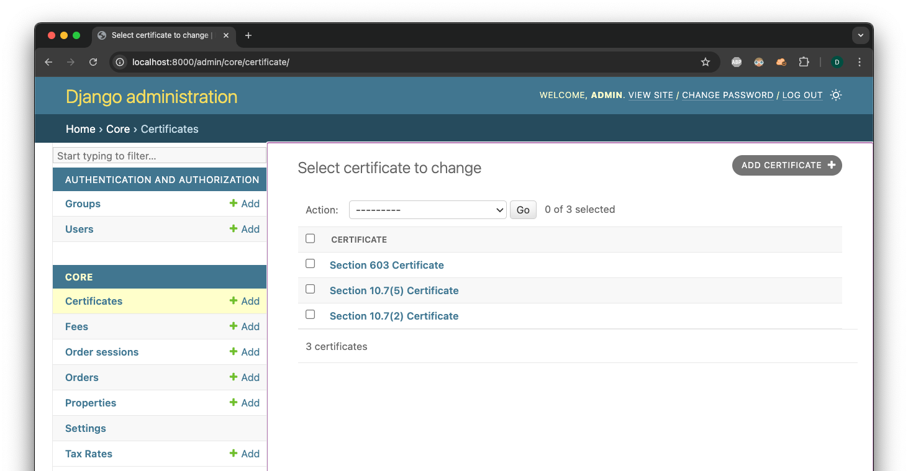

### Certificate Contains

Some Certificates contain all of one type and have other features, similar to a Parent-Child relationship. To create a Certificate Contains relationship:

1. Select the Certificate you want to make the Parent

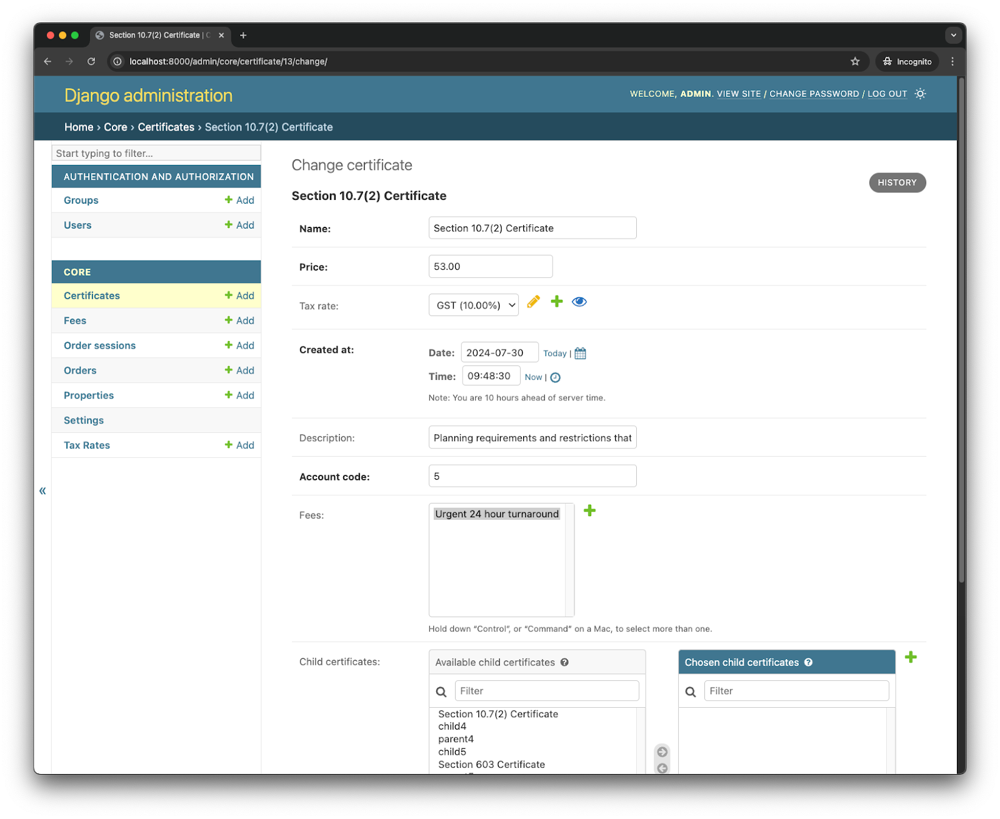

2. From the bottom, select the Certificate you want to be the Child
3. Click the "→" button to move it to the Child section

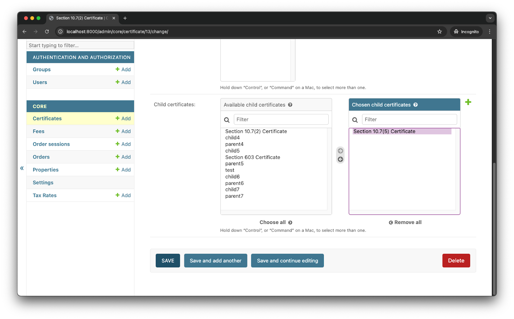

4. Click "Save"

## Order Model

An Order is created when a User completes payment successfully. All relevant information is shown, including which Certificates are required.

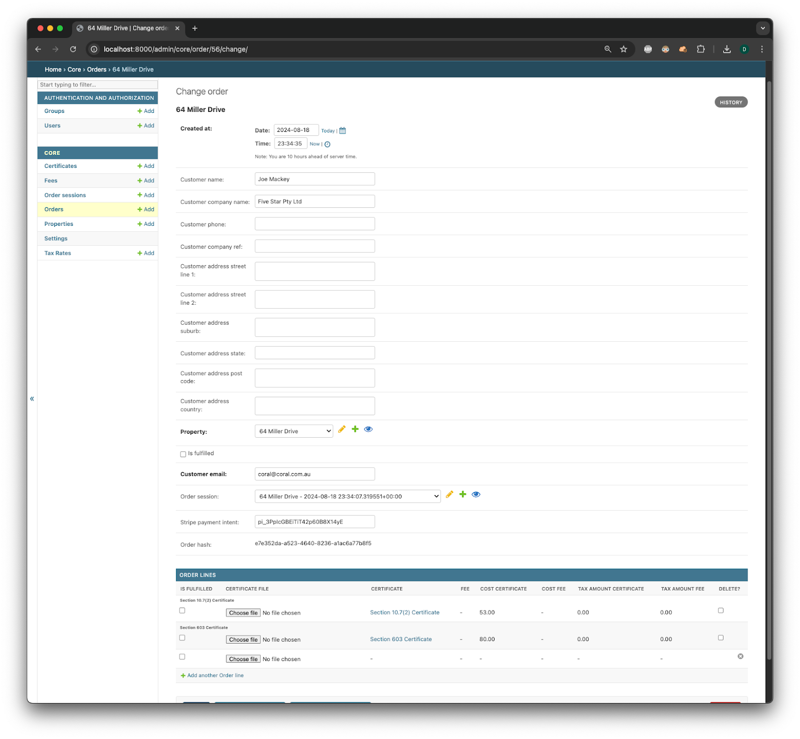
