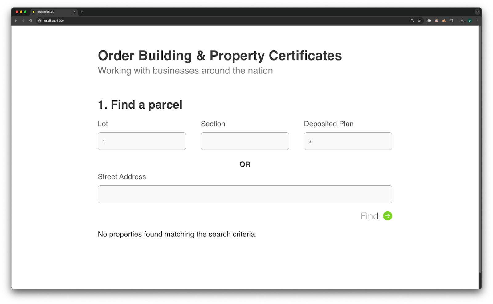
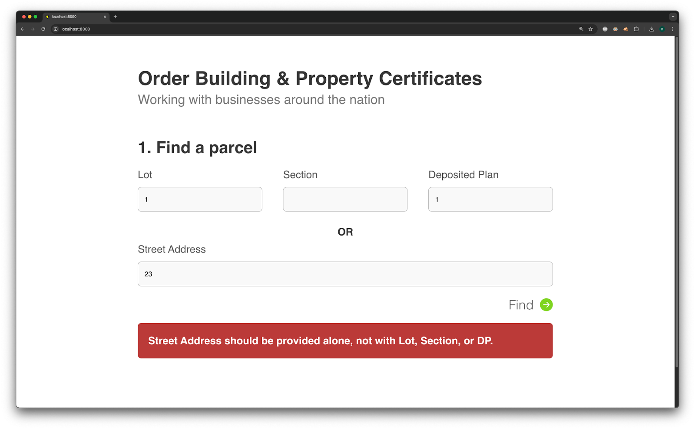
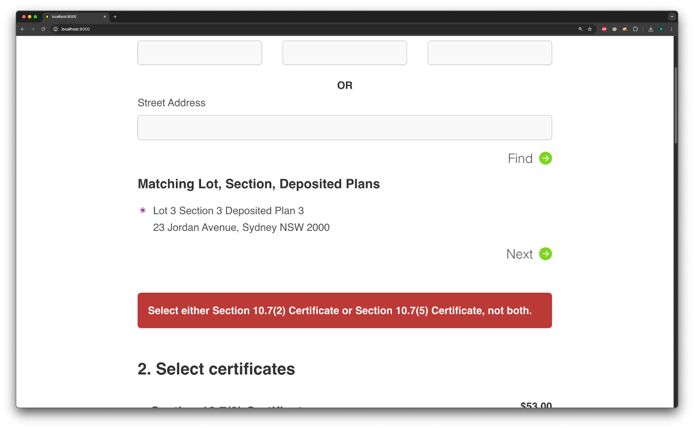
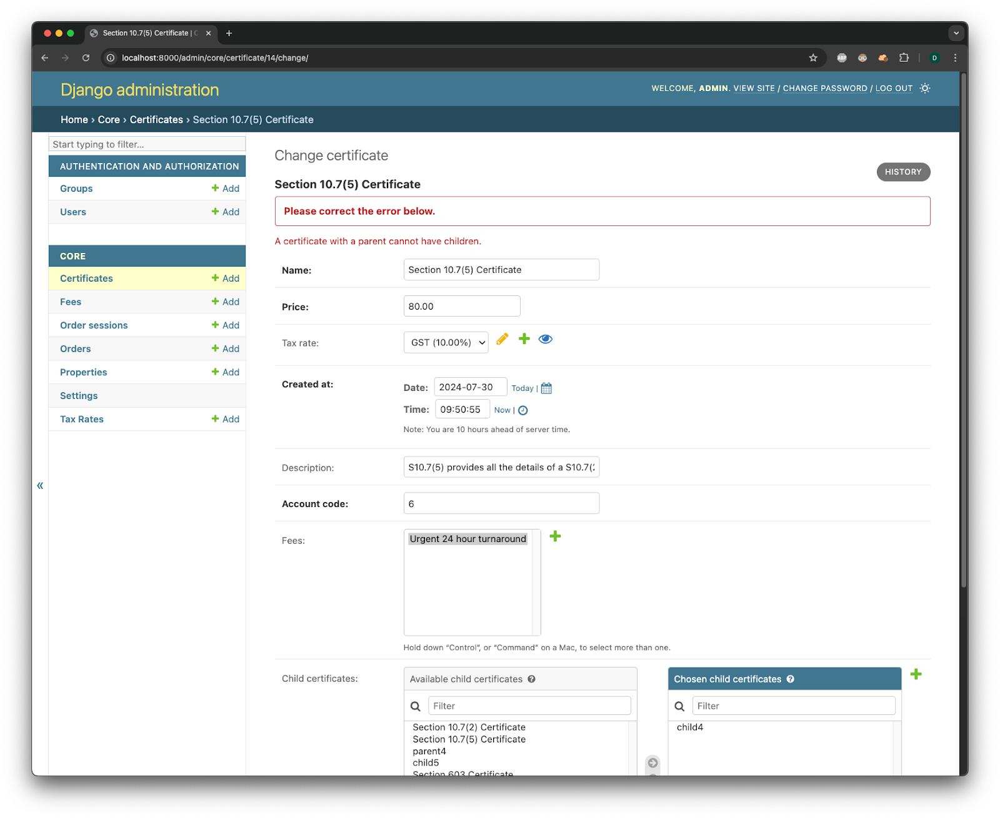
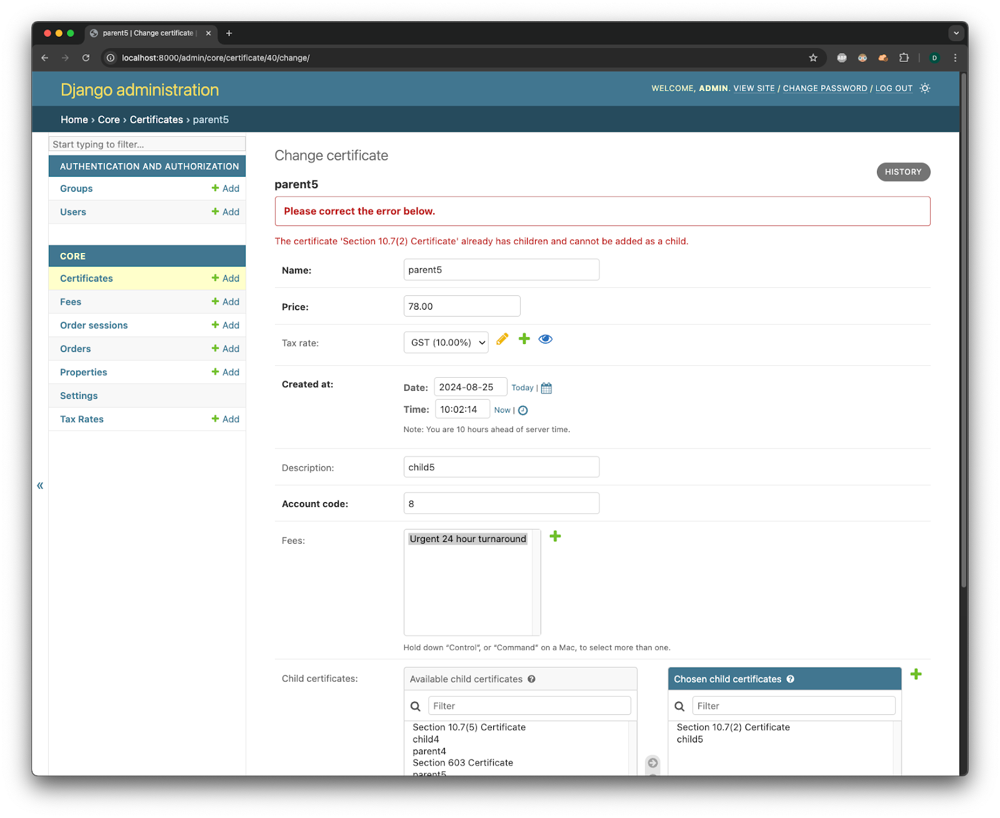

# Common Issues

## Parcel Not Found

**Solution:** Ensure you have entered a valid Lot, Section, or Deposited Plan Number. Alternatively, provide the Street Address.

## Property Search

To search a Property, you should use one of these two methods:

- Lot, Section, Deposited Plan
- Street Address

**Solution:** To successfully search a property, use either Lot, Section, Deposited Plan OR the Street Address—not both.

## Certificate Contains

Some Certificates contain the same information as another plus additional information. If you try to purchase certificates that have a Parent/Child Relationship, you will get the following error:

"Select either Certificate A or Certificate B, not both."

**Solution:** Ensure that you do not select Certificates in a Parent/Child Relationship.

## Certificate Parent/Child Relationship

When creating certificates that have a Parent/Child Relationship, issues may occur if you:

### A. Try to create a Child Certificate with a Parent who itself is a Child

**Error:** "A certificate with a parent cannot have children."

**Solution:** Ensure that when creating a Certificate in a Parent/Child Relationship, the Parent Certificate is not a Child of another Certificate.

### B. Try to add Parents as Children of other Certificates

**Error:** "The certificate 'A' already has children and cannot be added as a child."

**Solution:** Ensure that when you create a Child Certificate, it is not a Parent of another Certificate.
