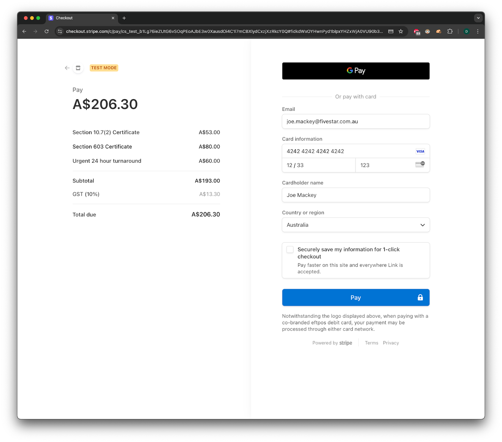

## Property Lot Finding & Selecting

### Parcel Search

Input the parcel details to find your property lot:

- **Lot:** Enter the property-associated Lot Number
- **Section:** Enter the Section Number
- **Deposited Plan:** Enter the Deposited Plan Number

Alternatively, you can search for a property by entering its Street Address in the appropriate field.

### Search for Property

Select the `Find` button to return a list of matching properties.

### Matching Assessments

If match(es) are found, a list will be displayed corresponding to the parcel details entered. Carefully review the matching property, select it, and click `Next`.

### Parcel Selection

Carefully review the parcel information, containing Lot, Section, and Deposited Plans. Select the property and click `Next`.

!!! Note

    This is the lot that your order will be associated with.

## Certificate Selection

### Select Certificates

From the list of available certificates, select the ones you require. Each certificate provides specific information. Select your required certificates from the list provided.

### Urgent Fee

You have the option to request urgent turnaround for an additional fee.

### Confirm Selection

Carefully review the selected certificates and any urgent fees.

## Your Details

### Contact Information

To proceed with ordering certificates, please enter:

- Full Name
- Business Name

Review your entered information and move on to the Payment section.

## Order Summary

Your order will be summarized, including any certificates and urgent fees (inclusive of GST). Carefully review your order and select `Submit`.

## Payment

You will be redirected to the Stripe Payment Gateway. Enter your details:

If your payment is successful, you will receive an email with a link to your order.
