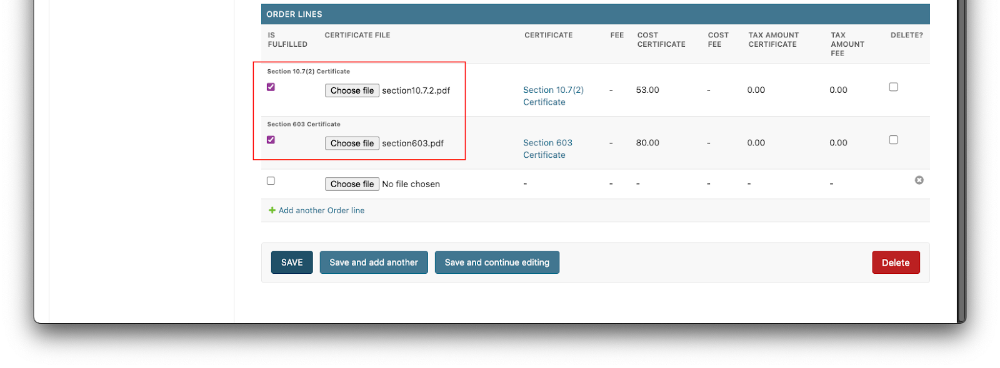
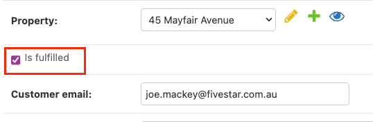
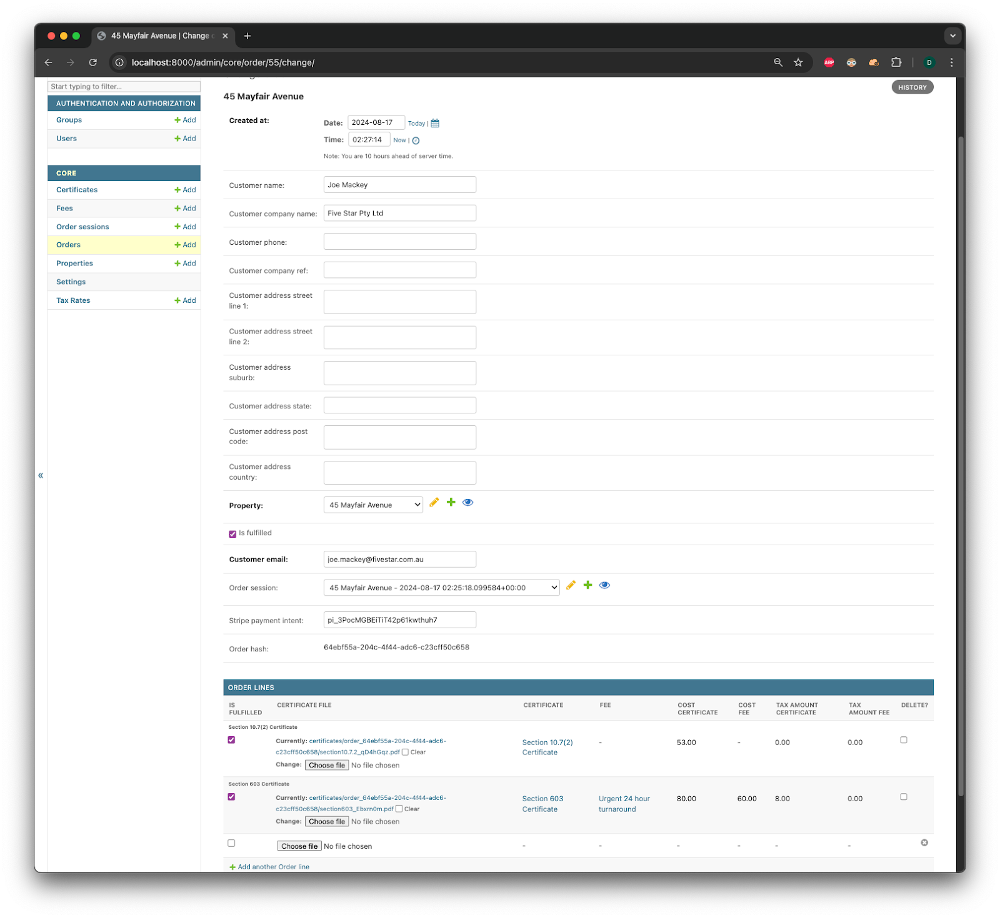

# Order Fulfilment

Once an order is completed, a back office worker can select the appropriate certificates and update the order. An email will be sent to the customer allowing them to download their certificates.

To complete an order fulfilment:

1. A back office worker can select "Choose File" and attach the appropriate certificates
2. Check the "Is Fulfilled" checkboxes for each item

To finalise the order:

1. Select the main "Is Fulfilled" checkbox
2. Click "Save"

A completed order should look similar to the image below:

